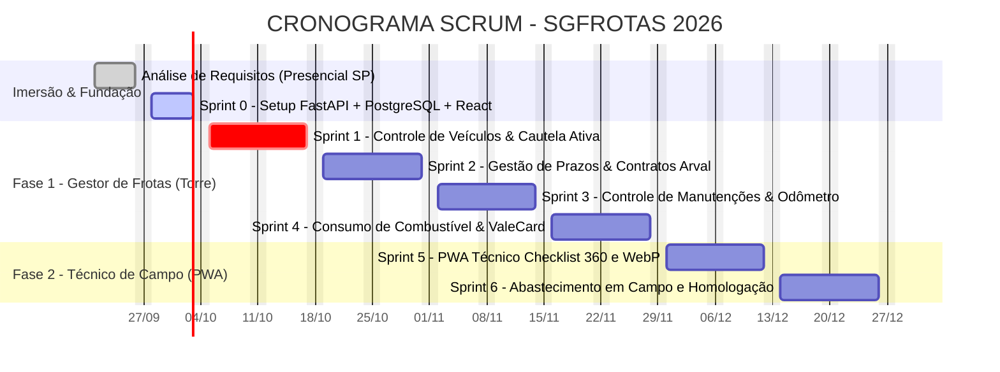

# 🚗 SGFrotas — Sistema de Gestão de Frotas

[](https://react.dev/)
[](https://tailwindcss.com/)
[-009688?logo=fastapi&logoColor=white)](https://fastapi.tiangolo.com/)
[](https://www.postgresql.org/)
[](https://scrumguides.org/)
[-16A34A)](https://developer.mozilla.org/pt-BR/docs/Web/API/IndexedDB_API)

> Plataforma corporativa para centralização, governança e auditoria da frota de veículos, controle imutável de custódias e operações de campo distribuídas pelas **17 Assistências Técnicas Positivo (ATPs)** em todo o território nacional.

---

## 🎯 1. Visão Geral do Projeto

O **SGFrotas** unifica processos anteriormente manuais e planilhas dispersas em um ecossistema integrado que conecta diretamente:

1. **A Torre de Controle (Gestores):** Tomada de decisão, conciliação financeira, controle de prazos de leasing/locação (Arval), manutenções preventivas, consumo de combustível (ValeCard) e central de multas (mitigação de multas NIC).
2. **A Equipe de Campo (Técnicos):** Acesso mobile ágil (PWA), consulta de custódia ativa, realização de vistorias digitais em 4 passos com fotos WebP (<200KB) e funcionamento 100% resiliente offline em garagens ou subsolos.

```
                      ┌────────────────────────────────────────┐
                      │          SISTEMA DE FROTAS             │
                      └──────────────────┬─────────────────────┘
                                         │
        ┌───────────────────┬────────────┴────────────┬───────────────────┐
        ▼                   ▼                         ▼                   ▼
┌───────────────┐   ┌───────────────┐         ┌───────────────┐   ┌───────────────┐
│ Gestão Frota  │   │  Operações    │         │  Combustível  │   │  Compliance   │
│   & Prazos    │   │ (Checklists)  │         │   & Custos    │   │  & Infrações  │
└───────┬───────┘   └───────┬───────┘         └───────┬───────┘   └───────┬───────┘
        │                   │                         │                   │
        │                   ▼                         ▼                   │
        │           ┌───────────────┐         ┌───────────────┐           │
        │           │ PWA do Técnico│         │ Conector REST │           │
        │           │ (Offline-1st) │         │ (ValeCard/Arv)│           │
        │           └───────────────┘         └───────────────┘           │
        ▼                                                                 ▼
┌───────────────────────────────────────────────────────────────────────────┐
│               PostgreSQL (Relacional) + Object Storage (Fotos)            │
└───────────────────────────────────────────────────────────────────────────┘
```

---

## 👥 2. Arquitetura por Personas de Negócio

O backlog do sistema é modelado por personas de negócio, garantindo valor contínuo aos usuários reais:

### 👔 Épico 1: Gestor de Frotas (Torre de Controle Web Desktop)

* **Prazo de Veículos:** Controle de vigência de contratos de leasing (Arval), alertas automáticos de multas e vencimentos, e cronograma de desmobilização/substituição de frota.
* **Controle de Veículos:** Cadastro mestre da frota com máquina de estados (`DISPONÍVEL`, `EM_USO`, `MANUTENÇÃO`, `SINISTRADO`), alocação por técnico e ATP.
* **Consumo de Combustível:** Integração com webservice REST da ValeCard (Token oficial), cálculo de $Km/L$, detecção de inconsistências (tanque excedente, odômetro invertido) e rateio por centro de custo.
* **Controle de Manutenção:** Acompanhamento preventivo a cada 10.000 km, histórico de manutenções corretivas, orçamentos e solicitação de carro reserva.
* **Central de Multas & Custódia Imutável:** Cruzamento da data/hora da autuação com o log de retirada/devolução para indicação imediata do condutor, evitando a multa por Não Indicação do Condutor (NIC).

### 🔧 Épico 2: Técnico de Campo (PWA Mobile-First)

* **Meu Veículo em Cautela:** Visão instantânea da placa, modelo, status e alertas preventivos da viatura sob sua responsabilidade.
* **Checklist Diário 360°:** Vistoria guiada em 4 etapas com silhueta interativa de lataria, seleção de avarias por toque, captura de 5 fotos com compressão WebP (<200KB) e assinatura digital com carimbo GPS.
* **Resiliência Offline-First:** Persistência em IndexedDB local garantindo preenchimento de checklists em garagens ou áreas remotas, com sincronização automática em background.
* **Abastecimento & Sinistros:** Registro de abastecimento com foto do cupom e hodômetro; botão de emergência de sinistro com envio de coordenadas e fotos da colisão.

---

## 🏛️ 3. Stack Tecnológica Homologada

| Camada                          | Tecnologia                           | Detalhes & Responsabilidade                                                                                                       |
| ------------------------------- | ------------------------------------ | --------------------------------------------------------------------------------------------------------------------------------- |
| **Banco de Dados**        | **PostgreSQL**                 | Modelagem relacional ACID, chaves estrangeiras, auditoria de custódia e integridade referencial.                                 |
| **Backend**               | **Python (FastAPI)**           | API REST assíncrona de alta performance, validação tipada com Pydantic, Swagger nativo e segurança JWT.                       |
| **Frontend**              | **React + Tailwind CSS**       | Construído sobre Vite, interface responsiva para desktops (gestor) e PWA mobile com touch targets$\ge 48\text{px}$ (técnico). |
| **Offline Engine**        | **IndexedDB + Service Worker** | Armazenamento de formulários, fotos e assinaturas no dispositivo do condutor com fila de sincronização.                        |
| **Notificações**        | **Firebase FCM**               | Notificações push de cobrança de checklists, trocas de óleo e revisões preventivas.                                          |
| **Integração ValeCard** | **API REST Oficial**           | Webservice de consulta de transações, limites e cartões com token corporativo ativo.                                           |
| **Integração Arval**    | **Parser CSV / REST**          | Importação de histórico de revisões, faturas de locação e dados cadastrais de terceirizados.                                |

---

## 📅 4. Roadmap de Sprints (Scrum 2026)

O projeto é executado em Sprints quinzenais (10 dias úteis, excluindo finais de semana):



| Sprint             | Período Previsto | Meta da Sprint (*Sprint Goal*)                                         | Entregáveis Técnicos                                                         |
| ------------------ | ----------------- | ------------------------------------------------------------------------ | ------------------------------------------------------------------------------ |
| **Sprint 0** | 28/09 a 02/10     | Setup da arquitetura FastAPI + PostgreSQL + React e seed base.           | Estrutura backend, container PostgreSQL, setup Vite e seed das 17 ATPs.        |
| **Sprint 1** | 05/10 a 16/10     | Controle de veículos & consulta de custódia ativa no app (*8 SP*).   | API`/cautela/status`, tela *"Meu Veículo"*, engine push FCM e testes E2E. |
| **Sprint 2** | 19/10 a 30/10     | Gestão de prazos de locação Arval, licenças e despacho de veículos. | Módulo de prazos/leasing, despacho com termo e máquina de estados.           |
| **Sprint 3** | 02/11 a 13/11     | Controle de manutenções preventivas (10k km) e corretivas.             | Alertas por hodômetro, bloqueio de pátio e workflow de aprovação Arval.    |
| **Sprint 4** | 16/11 a 27/11     | Ingestão REST ValeCard, auditoria de consumo e regras anti-fraude.      | Conector REST ValeCard, regras de tanque excedente e odômetro invertido.      |
| **Sprint 5** | 30/11 a 11/12     | PWA do Técnico com vistoria 360°, 5 fotos WebP e motor offline.        | Silhueta touch de avarias, compressão WebP (<200KB) e sync IndexedDB.         |
| **Sprint 6** | 14/12 a 28/12     | Abastecimento de campo, sinistros GPS e homologação nas 17 ATPs.       | Registro móvel de bomba/cupom, reporte de colisão e Go-Live geral.           |

---

## 📁 5. Estrutura de Diretórios

```
SistemaFrotas/
├── .agents/                      # Configurações, memórias, regras e skills do AG Kit
├── docs/                         # Documentação viva do projeto
│   ├── Analise de requisitos/    # Relatórios executivos (v1 a v4), brainstorming e apresentações
│   ├── Fotos/                    # Anotações e evidências manuscritas das reuniões presenciais
│   ├── Scketch/                  # Diagramas arquiteturais (Scrum_diagram.png/svg, Excalidraw)
│   ├── ValeCard/                 # Documentação de integração REST e manuais da API
│   ├── doc.md                    # Documentação técnica geral unificada
│   ├── tasks.md                  # Quadro de tarefas e acompanhamento do backlog por Sprint
│   └── cronograma_sgfrotas_gantt.json  # Arquivo de importação para o RoadTask Studio / EditorGantt
├── walkthrough/                  # Histórico estruturado de entregas e revisões
├── .gitignore                    # Regras de exclusão de arquivos Git
└── README.md                     # Este documento executivo
```

---

## 📊 6. Integração com RoadTask Studio (EditorGantt)

O cronograma do projeto está exportado no padrão JSON compatível com o [RoadTask Studio](file:///c:/Users/marci/Documents/Positivo/Projetos/SistemaFrotas/docs/cronograma_sgfrotas_gantt.json):

* **Arquivo:** [`docs/cronograma_sgfrotas_gantt.json`](file:///c:/Users/marci/Documents/Positivo/Projetos/SistemaFrotas/docs/cronograma_sgfrotas_gantt.json)
* **Como importar:** No RoadTask Studio, acione o menu **Importar Projeto / JSON** e selecione este arquivo para visualizar interativamente as Sprints, marcos e dependências em formato Gantt e CPM.

---

## 👥 7. Governança & Contato

* **Organização:** Positivo Tecnologia — Operações de Campo & Logística
* **Bases de Atendimento:** 17 Assistências Técnicas Positivo (ATPs) distribuídas pelo Brasil
* **Metodologia:** Scrum Guide 2020 & Anti-Gravity Autonomous Engineering
